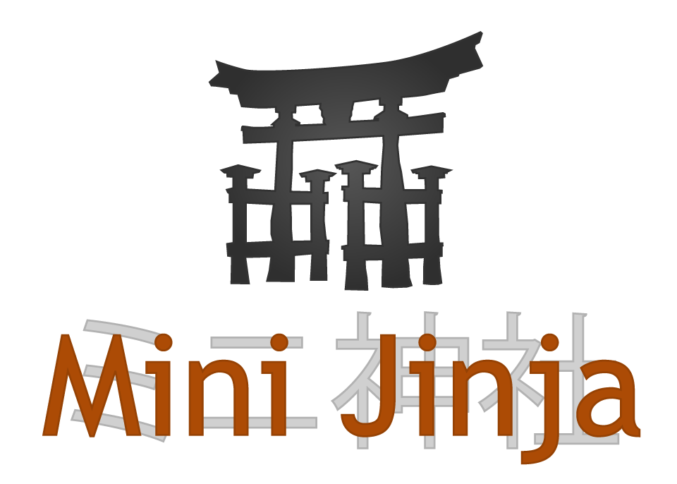

<div align="center">
  
  <p><strong>MiniJinja: a powerful template engine for Rust with minimal dependencies</strong></p>

[](https://github.com/mitsuhiko/minijinja/actions?query=workflow%3ATests)
[](https://github.com/mitsuhiko/minijinja/blob/main/LICENSE)
[](https://docs.rs/minijinja)

</div>

MiniJinja is a powerful but minimal dependency template engine for Rust which
is based on the syntax and behavior of the
[Jinja2](https://jinja.palletsprojects.com/) template engine for Python.

It's implemented on top of `serde` and only has it as a single dependency. It
supports a range of features from Jinja2 including inheritance, filters and
more.  The goal is that it should be possible to use some templates in Rust
programs without the fear of pulling in complex dependencies for a small
problem.  Additionally it tries not to re-invent something but stay in line
with prior art to leverage an already existing ecosystem of editor integrations.

## Example

```rust
use minijinja::Environment;
use serde::Serialize;

#[derive(Serialize)]
pub struct Context {
    name: String,
}

fn main() {
    let mut env = Environment::new();
    env.add_template("hello.txt", "Hello {{ name }}!").unwrap();
    let template = env.get_template("hello.txt").unwrap();
    println!("{}", template.render(&Context {
        name: "World".into()
    }).unwrap());
}
```

## License and Links

- [Documentation](https://docs.rs/minijinja/)
- [Issue Tracker](https://github.com/mitsuhiko/minijinja/issues)
- License: [Apache-2.0](https://github.com/mitsuhiko/minijinja/blob/main/LICENSE)
